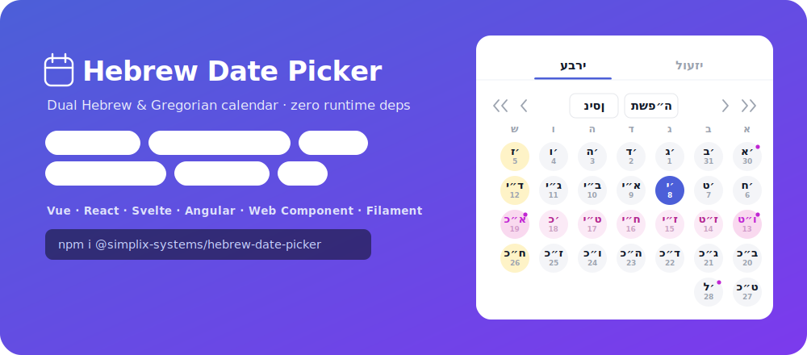

# Filament Hebrew Date Picker



A beautiful **Hebrew & Gregorian date picker** field for [Filament](https://filamentphp.com)
(v4 / v5), built on the [`hebrew-datepicker`](../hebrew-datepicker) package and **styled to
match Filament** — it uses the panel's primary color, gray scale, rounded corners,
focus rings and dark mode automatically.

By default the field uses **circular day cells** and a **borderless header** so it
blends into a Filament panel — while keeping all the highlights (holidays, Shabbat,
Parashat HaShavua). Change either with `->rounded(false)` / `->headerBorder()`, or
set project-wide defaults in the published config file (below).

Holidays (religious only), Parashat HaShavua, Rosh Chodesh, Shabbat highlighting,
range selection, a time picker (native / dropdown / stepper / clock), Diaspora mode,
month-only / year-only mode, and full RTL — inside a native-feeling Filament field.

## Requirements

- PHP 8.2+
- Filament v4 or v5 (Filament v5 = v4 + Livewire v4; the field API is identical)

## Installation

```bash
composer require simplix-systems/filament-hebrew-datepicker
php artisan filament:assets   # publish the pre-built JS/CSS into public/
```

**Tailwind (Filament v4 / custom theme):** so Tailwind doesn't purge the field's
utility classes, register the package's Blade views as a content source in your
theme's `app.css`:

```css
@source '../../../../vendor/simplix-systems/filament-hebrew-datepicker/resources/**/*.blade.php';
```

Then rebuild your theme (`npm run build`). If you use Filament's default theme
(no custom `app.css`), you can skip this — `filament:assets` already ships the
compiled CSS.

That's it — **consumers don't run Node/npm**. The picker (JS + CSS) is shipped
**pre-built** in `resources/dist/` (committed to the package), and the core
picker is **bundled inside** that JS. Composer never touches npm, so nothing is
downloaded from the npm registry at install time. `filament:assets` is a
standard Filament step ([docs](https://filamentphp.com/docs/4.x/advanced/assets))
that copies the registered assets into `public/`; run it again on deploy.

### Optional: publish the config and translations

```bash
# Project-wide defaults (calendar, rounded, headerBorder, highlights, lang…)
php artisan vendor:publish --tag="filament-hebrew-datepicker-config"
# → config/filament-hebrew-datepicker.php

# Picker labels — edit them, or add a new language
php artisan vendor:publish --tag="filament-hebrew-datepicker-translations"
# → lang/vendor/filament-hebrew-datepicker/{he,en}/picker.php
```

Values in the config file are the defaults for **every** field; anything you set
per-field (e.g. `->rounded(false)`) still wins for that field. To support a
language other than `he`/`en`, copy `picker.php` into a new locale folder,
translate the `labels`, and set that locale on the field with `->lang('xx')` (or
via the app locale).

## Maintaining (source of truth = the core npm package)

You maintain **only** the core package
([`@simplix-systems/hebrew-date-picker`](https://www.npmjs.com/package/@simplix-systems/hebrew-date-picker)).
This plugin **bundles** a built copy of that core into `resources/dist/` — it
pulls the core **from npm**, so the two repos don't need to live on the same
machine.

**Releasing a new version is a button click** — no local build:

> GitHub → **Actions** → **"Sync core from npm & release"** → **Run workflow**
> (optionally pin a `core_version` and pick the bump). It installs the core from
> npm, rebuilds `resources/dist/`, commits, tags `vX.Y.Z` and pushes — Packagist
> then picks it up via the webhook.

It also runs on a **daily schedule**, auto-releasing whenever a newer core is on
npm, and can be triggered instantly by the core's publish workflow (set a
`FILAMENT_SYNC_TOKEN` PAT secret on the core repo — optional).

To rebuild locally instead (`build.mjs` resolves the core from
`node_modules/@simplix-systems/hebrew-date-picker` first, then a sibling
`../hebrew-datepicker/src`, then the vendored copy):

```bash
npm install        # esbuild + the core from npm
npm run build      # → resources/dist/hebrew-date-picker.{js,css}  (prints "· core from: …")
```

Consumers never touch npm — the built assets are committed and shipped in the
Composer package.

## Usage

```php
use SimplixSystems\HebrewDatePicker\Forms\Components\HebrewDatePicker;

HebrewDatePicker::make('event_date')
    ->label('תאריך האירוע')
    ->calendar('hebrew')      // 'hebrew' (default) | 'gregorian'
    ->holidays()              // mark religious holidays + tooltips
    ->parasha()               // show Parashat HaShavua on Shabbat
    ->required();
```

The stored value is an ISO string `"YYYY-MM-DD"` (or `"YYYY-MM-DDTHH:mm"` with `->time()`).

### Range

```php
HebrewDatePicker::make('period')
    ->range();
// state is an array: ['start' => '2026-06-01', 'end' => '2026-06-30']
```

Cast it on the model, e.g. `protected $casts = ['period' => 'array'];`.

### Time

```php
HebrewDatePicker::make('starts_at')
    ->time()
    ->timeFormat('24')        // '12' | '24'
    ->timeStyle('native');    // 'native' (device) | 'dropdown' | 'stepper' | 'clock'
```

### Inline

```php
HebrewDatePicker::make('date')->inline();
```

### All options

| Method | Default | Description |
| --- | --- | --- |
| `calendar(string)` | `'hebrew'` | Primary calendar tab. |
| `range(bool)` | `false` | Start–end range (two calendars). |
| `time(bool)` | `false` | Add a time picker. |
| `timeFormat(string)` | `'24'` | `'12'` / `'24'`. |
| `timeStyle(string)` | `'native'` | `native` / `dropdown` / `stepper` / `clock`. |
| `diaspora(bool)` | `false` | 2-day Yom Tov + Diaspora parashot. |
| `monthOnly(bool)` | `false` | Pick whole months only. |
| `yearOnly(bool)` | `false` | Pick whole years only (takes precedence over `monthOnly`). |
| `rounded(bool)` | `true` | Circular day cells. `->rounded(false)` for square cells. |
| `headerBorder(bool)` | `false` | Border around the header nav/pills. `->headerBorder()` to frame them. |
| `displayCalendar(string)` | calendar | Calendar shown in the field after selection. |
| `holidays(bool)` | `true` | Highlight religious holidays. |
| `shabbat(bool)` | `true` | Highlight Saturdays. |
| `parasha(bool)` | `true` | Show the weekly Torah portion. |
| `compact(bool)` | `false` | Minimal layout. |
| `size(string)` | `'md'` | `sm` / `md` / `lg`. |
| `closeOnSelect(bool)` | `true` | Close the popup on pick. |
| `inline(bool)` | `false` | Render inline instead of a popup. |
| `primaryColor(string)` | Filament primary | Override the accent color. |

All methods accept a closure for [utility injection](https://filamentphp.com/docs/4.x/forms/custom-fields)
(e.g. `->diaspora(fn (Get $get) =>